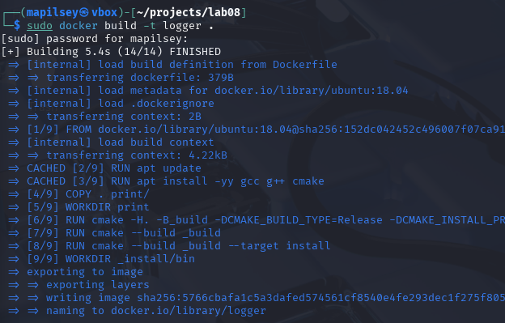
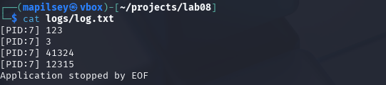

# Отчет по Docker-приложению Logger

## 1. Сборка Docker-образа
  
Создание Docker-образа с приложением:
```bash
docker build -t logger .
```
- Используется Dockerfile на основе Ubuntu 18.04
- Устанавливаются необходимые зависимости (gcc, g++, cmake)
- Копируется исходный код в контейнер
- Выполняется сборка приложения через CMake
- Настраивается точка входа (ENTRYPOINT)

## 2. Запуск контейнера с пробросом томов
  
Интерактивный запуск контейнера с пробросом директории логов:
```bash
docker run -it -v $(pwd)/logs:/home/logs logger
```
Особенности:
- Флаг `-it` для интерактивного режима
- Флаг `-v` для проброса директории логов
- Ввод данных с клавиатуры (Ctrl+C для завершения)
- Логи сохраняются на хост-машине в директории `logs/`

## 3. Проверка логов на хост-машине
  
Проверка сгенерированных логов после остановки контейнера:
```bash
cat logs/log.txt
```
Пример содержимого:
```
[PID:1] Hello from Docker!
[PID:1] This is a test message
Application stopped by SIGINT
```

## 4. Передача данных через pipe
  
Пакетная обработка данных через pipe:
```bash
echo -e "Line 1\nLine 2" | docker run -i -v $(pwd)/logs:/home/logs logger-app
cat logs/log.txt
```
Особенности:
- Флаг `-i` для поддержки стандартного ввода
- Автоматическое завершение после обработки всех данных
- Сохранение логов в той же директории

## Dockerfile
```dockerfile
FROM ubuntu:18.04

RUN apt update
RUN apt install -yy gcc g++ cmake

COPY . print/
WORKDIR print

RUN cmake -H. -B_build -DCMAKE_BUILD_TYPE=Release -DCMAKE_INSTALL_PREFIX=_install
RUN cmake --build _build
RUN cmake --build _build --target install

ENV LOG_PATH /home/logs/log.txt

VOLUME /home/logs

WORKDIR _install/bin

ENTRYPOINT ./demo
```

